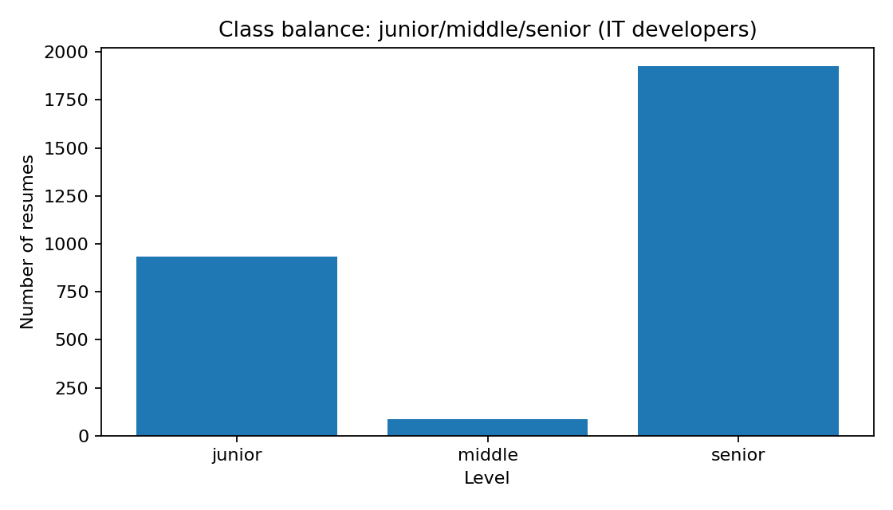

# PoC классификации уровня разработчика (junior/middle/senior)

## Цель

Proof of Concept (PoC): проверить, что по данным резюме hh.ru можно различать уровень
IT‑разработчика с разумным качеством.

В рамках PoC:

- выделяются резюме IT‑разработчиков;
- эвристически формируется целевая переменная;
- строится график баланса классов;
- обучается классификатор.

---

### Данные

Необходим подготовленный CSV-файл до экодинга (результат `5_parsing`), по
умолчанию: `data/processed/hh_prepared_raw.csv`.

### Запуск

Из корня репозитория:

```bash
python 7_classificator/train.py
```

Результаты:

- статистика фильтрации и метрики качества модели (**classification report**);
- график баланса классов в `resources/class_balance.png`.

---

## Логика

#### 1) Фильтрация IT‑разработчиков

Эвристика по названию должности (include/exclude паттерны). Снижает размер выборки, но уменьшает шум.

#### 2) Формирование целевой переменной `dev_level`

Эвристическая разметка по названию должности и/или по стажу:

1) Если в должности есть явные маркеры - берём их.
2) Иначе - fallback по стажу `experience_years`:
    - `< 2` -> `junior`
    - `< 8` -> `middle`
    - `>= 8` -> `senior`

#### 3) Признаки для классификации

Используются:

- числовые признаки (возраст, зарплата, стаж, образование и др.);
- категориальные (город, график, командировки и др.);
- дополнительные бинарные признаки `pos_*` - **флаги по стеку** из `position_text` как "прокси" навыков.

#### 4) Модель

Используется `LinearSVC`.

---

## Результаты эксперимента

### Фильтрация и размер датасета

```text
=== Filtering summary ===
Total rows in prepared_raw: 52131
After IT developer filter:  9028 (dropped 43103, 82.7%)
After level labeling:       8754 (dropped 274, 3.0%)
```

### Баланс классов

```text
=== Data summary ===
Labeled IT developers: 8754
Class distribution:
senior    3597
middle    3481
junior    1676
```



### Итоговая модель (LinearSVC)

```text
=== Model: LinearSVC ===
Balanced accuracy: 0.6792
              precision    recall  f1-score   support

      junior     0.5478    0.7701    0.6402       335
      middle     0.6405    0.4813    0.5496       696
      senior     0.7477    0.7861    0.7664       720

    accuracy                         0.6619      1751
   macro avg     0.6453    0.6792    0.6521      1751
weighted avg     0.6668    0.6619    0.6561      1751
```

---

## Выводы

1) **Модель лучше, чем baseline**: balanced accuracy составляет около 0.68 (для baseline - 0.33). Это показывает
   жизнеспособность
   идеи.

2) **Ошибки в основном для middle**:
    - `middle` имеет более низкий recall (около 0.48), что означает частые перепутывания с `junior` и `senior`.
    - Это ожидаемо, так как граница middle наиболее размытая и в реальности.

3) **Разметка целевой переменной шумная**:
    - `dev_level` формируется эвристикой по словам в должности и порогам стажа.
    - Термины могут соответствовать разным грейдам в разных компаниях.

4) **Дисбаланс классов присутствует**:
    - `junior` в выборке меньше, чем `middle/senior`, что осложняет обучение и увеличивает вероятность ошибок для
      junior; однако это приближено к реальной картине.

5) **Признаки ограничены**:
    - не используется полнотекстовый опыт/образование из-за сложностей парсинга, что могло бы
      дополнительно улучшить качество.